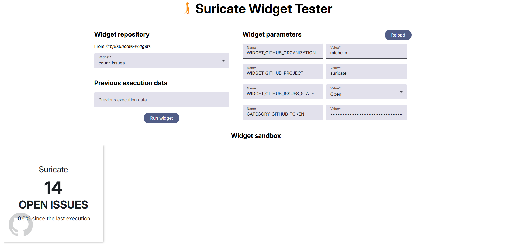

<div align="center">


# Suricate Widget Tester

[](https://img.shields.io/github/actions/workflow/status/michelin/suricate-widget-tester/push_master.yml)
[](https://github.com/michelin/suricate-widget-tester/releases)
[](https://github.com/michelin/suricate-widget-tester/commits/master)
[](https://github.com/michelin/suricate)
[](https://github.com/michelin/suricate)
[](https://sonarcloud.io/component_measures?id=michelin_suricate-widget-tester&metric=coverage&view=list)
[](https://sonarcloud.io/component_measures?metric=tests&view=list&id=michelin_suricate-widget-tester)
[](https://opensource.org/licenses/Apache-2.0)

[Install](#install) • [Suricate](https://github.com/michelin/suricate) • [Widgets](https://github.com/michelin/suricate-widgets)

Build and validate your Suricate widget in a sandboxed setup before integrating it into a Suricate instance.



</div>

## Table of Contents

* [Download](#download)
* [Install](#install)
* [Configuration](#configuration)
  * [Repository](#repository)
* [Contribution](#contribution)

## Download

You can download the Suricate Widget Tester as a fat jar from the [GitHub releases page](https://github.com/michelin/suricate-widget-tester/releases) (requires Java 21).

## Install

The Suricate Widget Tester is built on the [Spring Boot framework](https://spring.io/) and can be configured using a Spring Boot
configuration file, which includes a sample file located at `src/main/resources/application.properties`.

If necessary, you can override the properties from the default `application.properties` file by following
the [Spring Boot externalized configuration guide](https://docs.spring.io/spring-boot/reference/features/external-config.html).
For example, you can create a custom  `/config/application.properties` or set the `--spring.config.location` system
property when running the fat jar file:

```console
java -jar suricate-widget-tester.jar --spring.config.location=classpath:\,file:C:\myCustomLocation\
```

After running the command, the application will be accessible on http://localhost:8085/.

## Configuration

### Repository

The Suricate Widget Tester reads the content of a widget repository. 
The repository must follow the required structure (see the [official open-source widgets GitHub repository](https://github.com/michelin/suricate-widgets)).

The repository location can be configured with the following property:

```yml
application.widgets.repository: <path-to-repository>
```

It is set to `/tmp` by default.

## Contribution

We welcome contributions from the community! Before you get started, please take a look at our [contribution guide](https://github.com/michelin/suricate-widget-tester/blob/master/CONTRIBUTING.md) to learn about our guidelines and best practices. We appreciate your help in making Suricate a better tool for everyone.
