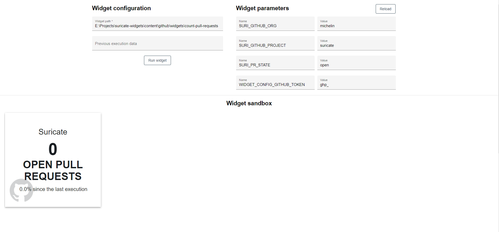

# Suricate widget tester 

This repository contains the source code of the Suricate widget tester application.

## 📚 Wiki

Information and instructions about the use of the widget tester are located in [the wiki](https://github.com/michelin/suricate-widget-tester/wiki) 🙌
